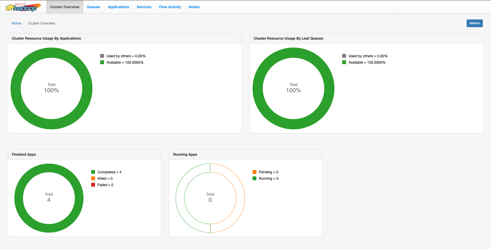
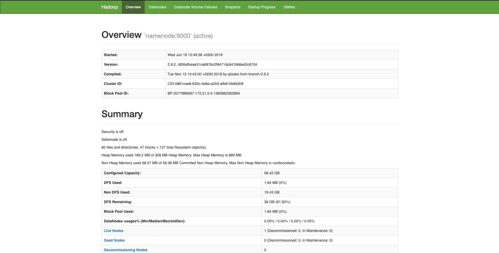
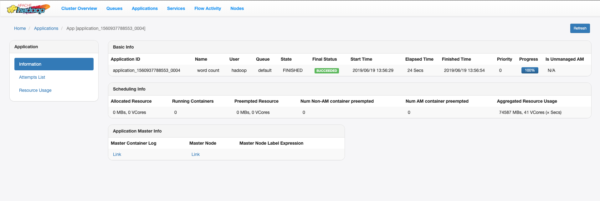
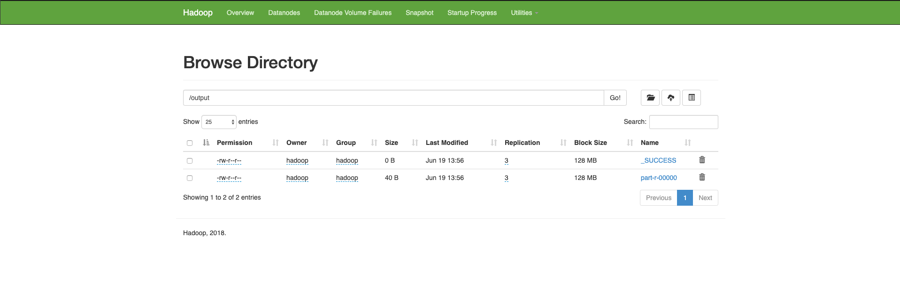

# Hadoop Docker

----
Dockerized Hadoop HDFS with Yarn. 
The default Hadoop version is `2.9.2`, could be easily changed during image creation.
All the ports are configured to fit 3.x releases, as described in [this](https://issues.apache.org/jira/browse/HDFS-9427) ticket.

# Running
```
$ cd hadoop-base/
$ docker build -t hadoop-base-image .
```
In order to change Hadoop version specify `HADOOP_VERSION` argument:
```sh
$ docker build --build-arg HADOOP_VERSION=X.Y.Z -t hadoop-base-image .
```
Then you can start everything with this command:
```sh
$ docker-compose up --build
```

**Fast navigation links**
- Yarn Resource Manager http://localhost:8088/ui2/#/cluster-overview
- Hdfs Name Node http://localhost:9870/dfshealth.html#tab-overview

# Hadoop Cluster
- **Resource Manager** runs on `8088` port
ResourceManager (RM) is the master that arbitrates all the available cluster resources and thus helps manage the distributed applications running on the YARN system. It works together with the per-node NodeManagers (NMs) and the per-application ApplicationMasters (AMs).
- **Node Manager** runs on `8042` port
The NodeManager (NM) is YARN’s per-node agent, and takes care of the individual compute nodes in a Hadoop cluster. This includes keeping up-to date with the ResourceManager (RM), overseeing containers’ life-cycle management; monitoring resource usage (memory, CPU) of individual containers, tracking node-health, log’s management and auxiliary services which may be exploited by different YARN applications.
- **History Server** runs on `8188` port
The history server REST API’s allow the user to get status on finished applications.
- **Name Node** runs on `9870` port
The NameNode is the centerpiece of an HDFS file system. It keeps the directory tree of all files in the file system, and tracks where across the cluster the file data is kept. It does not store the data of these files itself.
- **Data Node** runs on `9864` port
The DataNode stores data in the HDFS. A functional filesystem has more than one DataNode, with data replicated across them. It then responds to requests from the NameNode for filesystem operations. Client applications can talk directly to a DataNode, once the NameNode has provided the location of the data

# Usage
Not mandatroy, but highly preferable
Add to the `/etc/hosts` the following data:
```
127.0.0.1 resourcemanager
127.0.0.1 namenode
127.0.0.1 datanode
127.0.0.1 nodemanager
127.0.0.1 historyserver
```
Navigate to the [YARN RM](http://resourcemanager:8088/ui2/#/cluster-overview) page and you should see the following UI

For the old UI use [this](http://resourcemanager:8088) link.

Navigate to the [HDFS NN](http://namenode:9870/dfshealth.html#tab-overview) page and you should see the following UI


## Running Jobs
```sh
$ cd app/
$ docker build -t hadoop-wordcount-image .
$ docker run --network hadoop_resource_hadoop-net -it hadoop-wordcount-image
```
This will create /input/input.txt file on hdfs and will launch a simple word count programm.
Navigate to the [Applications](http://resourcemanager:8088/ui2/#/yarn-apps/apps) to check your job is run correctly.


After job finishes, navigate to the [Browse Direcotry](http://namenode:9870/explorer.html#/output) tab on the NameNode UI, there should be `part-r-00000` file.


Running each service separately
1. Create a bridge network
```
docker network create --driver=bridge hadoop-net
```
2. Buid images
```
docker build -t hadoop-base-image .
docker build -t hadoop-namenode-image .
docker build -t hadoop-datanode-image .
docker build -t hadoop-resourcemanager-image .
docker build -t hadoop-nodemanager-image .
docker build -t hadoop-historyserver-image .
```
3. Run containers
**Namenode**
```
docker run -dit --name hadoop-namenode -p 9870:9870 --hostname namenode \
-e CLUSTER_NAME=test \
--network hadoop-net \
hadoop-namenode-image
```
**Datanode**
```
docker run -dit --name hadoop-datanode -p 9864:9864 --hostname datanode \
-e CLUSTER_NAME=test \
-e SERVICE_PRECONDITION=namenode:9870 \
--network hadoop-net \
hadoop-datanode-image
```
**Resourcemanager**
```
docker run -dit --name hadoop-resourcemanager -p 8088:8088 --hostname resourcemanager \
-e CLUSTER_NAME=test \
-e SERVICE_PRECONDITION="namenode:9870 datanode:9864" \
--network hadoop-net \
hadoop-resourcemanager-image
```
**Nodemanager**
```
docker run -dit --name hadoop-nodemanager -p 8042:8042 --hostname nodemanager \
-e CLUSTER_NAME=test \
-e SERVICE_PRECONDITION="namenode:9870 datanode:9864 resourcemanager:8088" \
--network hadoop-net \
hadoop-nodemanager-image
```
**Historyserver**
```
docker run -dit --name hadoop-historyserver -p 8188:8188 --hostname historyserver \
-e CLUSTER_NAME=test \
-e SERVICE_PRECONDITION="namenode:9870 datanode:9864 resourcemanager:8088" \
--network hadoop-net \
hadoop-historyserver-image
```

# Future Work
-----
Add [Dr.Elephant](https://github.com/linkedin/dr-elephant) as a monitoring service  
Customizable host names  
Exposing ports  

# Extra
-----
Alternatives:  
Apache Bigtop: https://github.com/apache/bigtop       
Apache Ambari: https://ambari.apache.org/    
Docker: https://github.com/big-data-europe/docker-hadoop    

Config xml defaults:    
https://hadoop.apache.org/docs/r2.9.2/hadoop-project-dist/hadoop-common/core-default.xml
https://hadoop.apache.org/docs/r2.9.2/hadoop-project-dist/hadoop-hdfs/hdfs-default.xml
https://hadoop.apache.org/docs/r2.9.2/hadoop-mapreduce-client/hadoop-mapreduce-client-core/mapred-default.xml
https://hadoop.apache.org/docs/r2.9.2/hadoop-yarn/hadoop-yarn-common/yarn-default.xml

Deprectaed props:   
https://hadoop.apache.org/docs/current/hadoop-project-dist/hadoop-common/DeprecatedProperties.html

Hadoop migration guide:  
https://www.cloudera.com/documentation/enterprise/5-4-x/topics/cdh_ig_mapreduce_to_yarn_migrate.html

http://hadoop.apache.org/docs/r2.9.1/hadoop-mapreduce-client/hadoop-mapreduce-client-core/MapReduceTutorial.html

Default ports:  
https://www.stefaanlippens.net/hadoop-3-default-ports.html

Hadoop migration guide:  
https://www.cloudera.com/documentation/enterprise/5-4-x/topics/cdh_ig_mapreduce_to_yarn_migrate.html  
 
